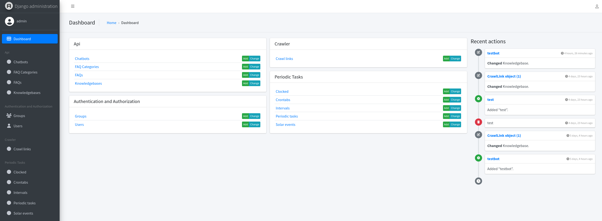
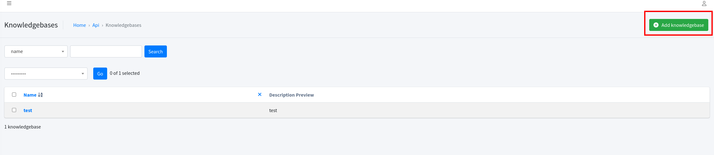
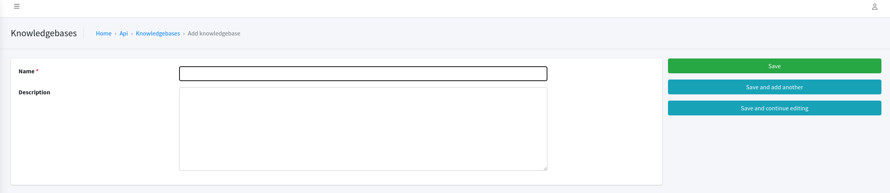
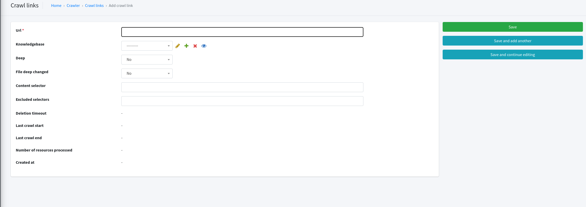
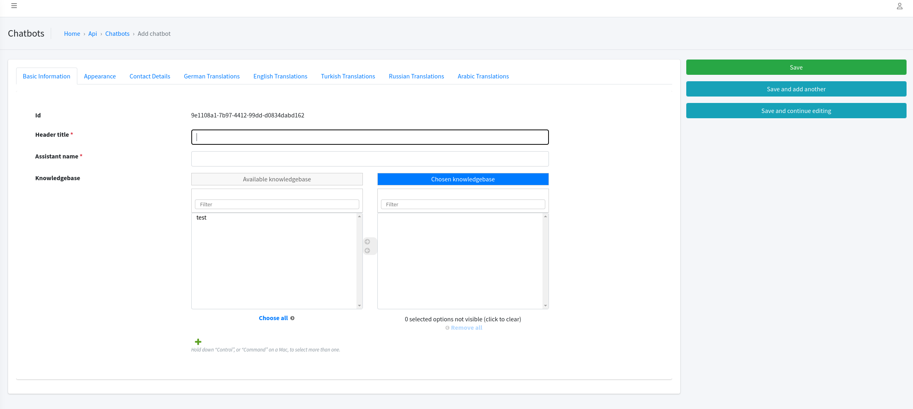
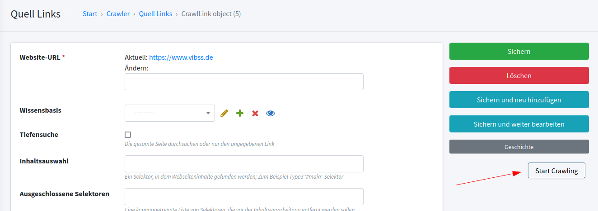
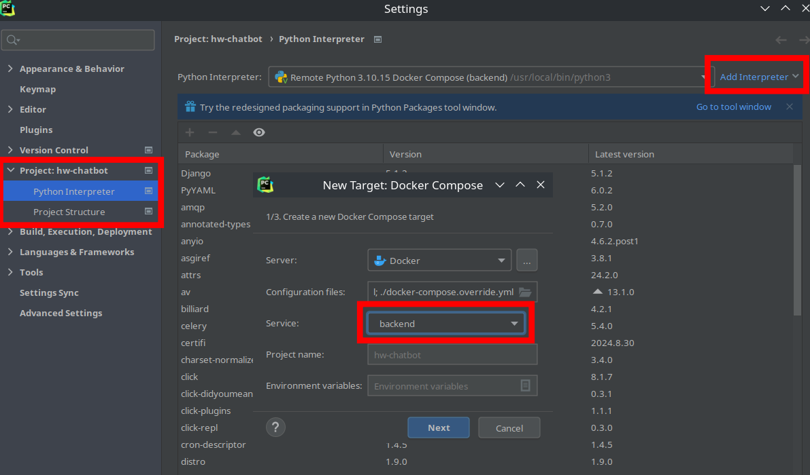
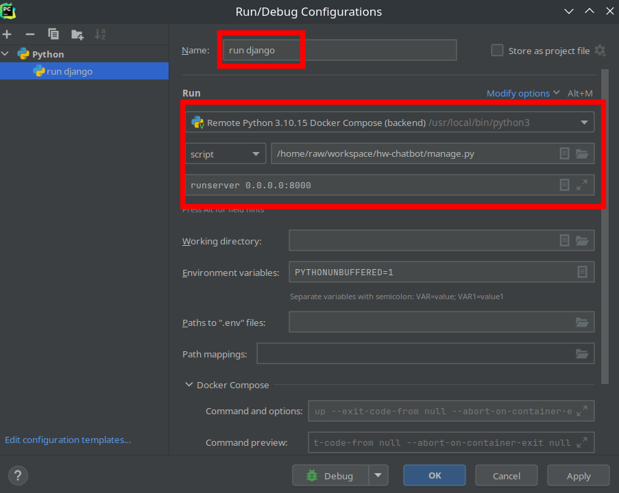

# Getting started

## Traefik
This project uses Traefik for providing http endpoints, which removes the need for port bindings. Please see and follow

https://wiki.k8s.hw.ag/en/docker-compose/dev/Traefik

for instructions.

if you have no access, then just use this docker-compose.yml in some location outside of this project:
```
services:
  traefik:
    restart: always
    image: traefik:saintmarcelin #v2
    network_mode: host
    labels:
      # Frontend
      - "traefik.enable=true"
      - "traefik.http.routers.traefik.rule=Host(`traefik.localhost`)"
      - "traefik.http.services.traefik.loadbalancer.server.port=81"

    command:
      - --api.dashboard=true
      - --api.insecure=true
      - --providers.docker
      - --providers.docker.exposedByDefault=true
      - --providers.docker.defaultRule=Host(`{{ .Name }}.localhost`, `{{ .ContainerName }}.localhost`)
      - --providers.docker.endpoint=unix:///var/run/docker.sock
      - --entrypoints.web.address=:80
      - --entrypoints.traefik.address=:81
      - --log.level=INFO
    volumes:
      - /var/run/docker.sock:/var/run/docker.sock:ro
```


## setup .env
```bash
cp .env.dist .env
cp frontend/.env.dist frontend/.env
```
then adjust it to your needs, especially add an OpenAI key.

## Docker-Compose

This project has 4 possible docker compose profiles for different use-cases:
- default (nothing specified): static frontend and backend, ready for answering queries, no crawling or rag processing
- js: starts the additional vite dev server for javascript development that reloads on changes
- rag: builds and starts the workers needed for crawling and rag processing (downloads >5GB of data!)
- gpu: same as rag, with even more downloads for gpu acceleration on pdf processing!

you can add --profile to every docker compose command, i.e. `docker compose --profile <profile> up -d`

But if you do not enjoy typing so much, add your preferred profile to the .env COMPOSE_PROFILES. Docker compose will
pick you choice up ther by its own. If you want more convenience, do `. activate.sh`
command comes with a handy alias called comp. With that active, you can just write `comp up -d`.

if you are starting out, better first run:
```bash
docker compose build --pull
```
especially with the rag profile, just an `up` may run into an timeout.

then continue with `docker compose up -d` to bring everything up. You will have to specify the profile
for all docker compose commands in the future.

While the django backend will reload on python code changes, that does not apply to the background workers.
When developing workers, it is recommended to create a cli command to access and debug the worker's functionality.

## Project Setup
create yourself a django admin:

```shell
docker compose exec backend python manage.py createsuperuser --email admin@example.com --username admin
```

visit the django admin and login with your django admin
```
http://backend-hw-chatbot.localhost/admin
```



Click on Knowledgebases in the Menu an create your first Knowledgebase with the add Knowledgebase Button



After creating your knowledgebase, click on crawl links and create a starting url for a webpage you want to crawl,
also do not forget to set the knowledgebase you want to save the crawled resources to.


After creating a page to crawl and adding a knowledgebase you also need to configure your chatbot.
Here you need to register the knowledgebase the chatbot is allowed to use.



After setting up your entities you can visit to manually start the crawling process for all registered pages
```
http://backend-hw-chatbot.localhost/api/crawler/start-crawl
```
Or use the "Start Crawling" button in the backend. If the button is clicked it will change to "Stop Crawling" (using revoke
by stamped headers -> takes some time). If the "Stop Crawling" button is clicked it will not change to "Start Crawling" again 
until all tasks are revoked and cleanup is done.



## Start chatting
```
http://backend-hw-chatbot.localhost/demo/<chat-id>/fullscreen/
```
## Step debugging / intellisense
This project uses a docker container for running the python backend and workers. You require a pycharm professional
or intellij ultimate in order to effectively work with this project.

### Setup python interpreter
In Pycharm/Intellij, go to files -> settings -> project: hw-chatbot -> project interpreter and click "add interpreter"
-> "on docker compose". Select the backend service, leave the rest at default and press next. In the next view, leave it
at "system interpreter" and press create.



### Updating Requirements.txt (after pull for example)
The docker container installs the requirements.txt and requirements-new.txt at build time. If you get the error that requirements are missing,
first run `docker compose build  --pull` and then `docker compose up -d`.
This will pull the base images from our registry and 
### Dependencies in pycharm are not showing up correctly
make sure your images are up to date. Then go "File" -> "Invalidate caches", select 
"clear system cache and file history" and press "Invalidate and restart". This is required because intellij may not
detect changes in the docker image. If that is not working, check your "File" -> "Settings" -> "Project Interpreter"
and invalidate caches again. 

### Create a run configuration
Setup the configuration like in the screenshot, using the just created python interpreter.

the arguments are `runserver 0.0.0.0:8000`.

Then you should be able to place a breakpoint, start a debugging session, do an api call (i.e. by using the swagger ui) and end up debugging.

# Project Stucture


This project is structured a bit differently than classic django projects. the "api" app lives
within the "backend" project and functionalities are organized into submodules within that app instead being split
up into files that contain classes by type. i.e. the serializer for the tts api will be found withing the tts module
and not in a global "serializers.py" file.

| Location                   | Content                                                                                       |
|----------------------------|-----------------------------------------------------------------------------------------------|
| `/backend`                 | Django Project & Backend Config                                                               |
| `/backend/api`             | Django App (`/api`)                                                                           |
| `/backend/api/tts`         | Code related to the TTS functionality                                                         |
| `/backend/api/chat`        | chatbot query endpoint                                                                        |
| `/backend/api/chat_config` | Configuration for the chatbot instances                                                       |
| `/backend/api/worker`      | Workers related code                                                                          |
| `/frontend`                | Vue App .                                                                                     |
| `/frontend/src/main.js`    | JS Application Entry Point                                                                    |
| `/frontend/index.html`     | [Html Application Entry Point](https://cli.vuejs.org/guide/html-and-static-assets.html) (`/`) |
| `/public/static`           | Static Assets                                                                                 |
| `/dist/static`             | Bundled Assets Output (generated at `npm run build`)                                          |

## urls 
- Admin Panel: http://backend-hw-chatbot.localhost/admin/ (create an admin user, see above)
- Swagger Api Doc: http://backend-hw-chatbot.localhost/doc/swagger/
- Redoc: http://backend-hw-chatbot.localhost/doc/redoc/
- OpenApi YAML Spec: http://backend-hw-chatbot.localhost/doc/
- Qdrant (vector db) Dashboard: http://qdrant-hw-chatbot.localhost/dashboard#/welcome
- Frontend: http://backend-hw-chatbot.localhost/demo/<chat-id>/
- Frontend: http://backend-hw-chatbot.localhost/demo/<chat-id>/fullscreen/
- RabbitMQ Dashboard: http://rabbitmq-hw-chatbot.localhost (login guest:guest)

## Workers
The code related to the workers lives in the `/backend/api/worker` directory. The background tasks are defined in the backend/tasks.py file.
For convenience and easier debugging, we provide a cli method to trigger each task, both synchronous and asynchronous using
the background worker.

### Rag Processing
Located in `/hw_rag`, this module is responsible for filling and maintaining the vector db that is used
for RAG retrival. Usually, this worker is triggered by other modules that discover new documents to process.

It can be manually triggered by using `manage.py process_document 1` to put document with id 1 in the queue or by 
`manage.py process_document 1 --sync` to directly call the processing function without using the background worker, which
is especially useful for easier debugging.

### Services

#### MongoService
The MongoService is responsible for interacting with mongodb. Please dont use pymongo directly and try to implement
methods within it.

## Useful Commands

Django commands can be executed with ```python manage.py <command_name> <command args>```

#### Check for discovered documents in the vector databse:
```python manage.py check_qdrant_entries <knowledgebase_id>``` 

Their is also a optional ```--requeue``` flag to automatically requeue resources that are not found in the vector db

```python manage.py benchmark_answers <knowledgebase_id>```

This command automatically asks the in ```benchmark_data/questions``` stored and predefined questions and scores them

## Embed Chatbot Script

see: [Readme](./frontend/readme.md)

# Usage

## Multi-Tenancy
To use multi-tenanc:
1. create one or more tenants using the admin
2. create a "Tenant" user group and assign permssions to:
   - Chatbots
   - Knowledgebases
   - FAQ
   - Crawlinks if required
   - Users (if they should be able to add new tenant users)

Hints:
- Do not assign permissions to Groups, as they would be able to change their own permissions then.
- UserProfile permission is also not required
- If a user creates another user, he gets the same permissions and groups as the creating user

## Webdav Resources
1. create a WebDAV Resource in the Admin
2. The Source URL Shuould be fomrated like: ```https://host.com/remote.php/dav/files/USERNAME``' or in case of a public share ```https://host.com/public.php/dav/files/YOUR-SHARE-TOKEN```
3. In the Auth Tab enter your username and password if needed
4. In the crawling options you can set your starting directory. Please be aware to not use a precedding ``/`` . A trailing slash is allowed.
   A Folder can look like ```Folder/```
5. you can also set a option for deep recursive crawling or to only crawl the starting directory aswell as config for automated crawling


# Troubleshooting / FAQ
## How can i do local port bindings?
If you want to bind servics locally, create a file `docker-compose.override.yml`
see `docker-compose.override.sample.yml` for examples.
Its recommended to only bind the ports you actually need. 

**Keep in mind that your overrides file is only local and you need to update it manually in case the services in
the main docker-compose.yml change!**

## How do i create Database migrations?
After changing the data models, run:
`docker compose run backend python manage.py makemigrations`
to make the migrations, then
`docker compose run backend python manage.py migrate` to apply them.

## How do i update the po translation files?
run `docker compose exec backend django-admin makemessages -a`

then check the changes in the `locale` folder and make sure to translate them.

then finally run `docker compose exec backend django-admin compilemessages` to apply them.

## How can i reset a knowledgebase easily?
use manage.py reset_knowledgebase <id> to recreate the defined collection

##  ModuleNotFoundError: No module named 'django'

Trace:
```
Traceback (most recent call last):
2024-10-30T06:37:22.787504048Z   File "/app/manage.py", line 11, in main
2024-10-30T06:37:22.787510293Z     from django.core.management import execute_from_command_line
2024-10-30T06:37:22.787514306Z ModuleNotFoundError: No module named 'django'
2024-10-30T06:37:22.787516291Z 
2024-10-30T06:37:22.787518132Z The above exception was the direct cause of the following exception:
2024-10-30T06:37:22.787520259Z 
2024-10-30T06:37:22.787522099Z Traceback (most recent call last):
2024-10-30T06:37:22.787524093Z   File "/app/manage.py", line 22, in <module>
2024-10-30T06:37:22.787531774Z     main()
2024-10-30T06:37:22.787542297Z   File "/app/manage.py", line 13, in main
2024-10-30T06:37:22.787561671Z     raise ImportError(
2024-10-30T06:37:22.787571387Z ImportError: Couldn't import Django. Are you sure it's installed and available on your PYTHONPATH environment variable? Did you forget to activate a virtual environment?
```

Solution: 
```bash
docker compose build
docker compose up -d
```
Dont forget your profile if you use it.
