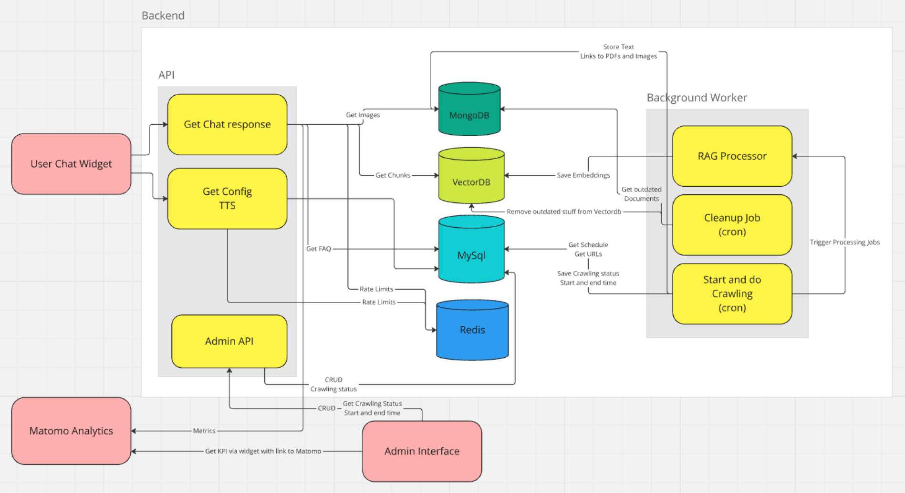

# Chatbot Deployment Dokumentation

- [Chatbot Deployment Dokumentation](#chatbot-deployment-dokumentation)
- [Einführung](#einführung)  
  - [Systemübersicht](#systemübersicht)  
  - [Funktionsweise](#funktionsweise)
- [Systemanforderungen](#systemanforderungen)
- [Weitere Anforderungen](#weitere-anforderungen)  
  - [OpenAI API-Zugang](#openai-api-zugang)  
  - [Domain & DNS](#domain--dns)
- [Server-Vorbereitung](#server-vorbereitung)
  - [Betriebssystem-Installation](#betriebssystem-installation)
  - [Docker Installation](#docker-installation)

- [Anwendungs-Deployment](#anwendungs-deployment)
  - [SSL-Termination mit Traefik](#ssl-termination-mit-traefik)
  - [Wichtiger Hinweis zur Software-Distribution](#wichtiger-hinweis-zur-software-distribution)
  - [Erste Einrichtung](#erste-einrichtung)
  - [Konfiguration](#konfiguration)
  - [Starten der Dienste](#starten-der-dienste)
  - [Admin-User anlegen](#admin-user-anlegen)

- [Überwachung & Wartung](#überwachung--wartung)
  - [Log-Überwachung](#log-überwachung)
  - [Zustandsüberwachung](#zustandsüberwachung)
  - [Skalierung der Dienste](#skalierung-der-dienste)
  - [Updates](#updates)
- [Fehlerbehebung](#fehlerbehebung)
- [Initiales Crawling](#initiales-crawling)
- [Kontakt](#kontakt)

Version 1.0.1 - 13.12.2024

Helm & Walter IT-Solutions GbR  
Räcknitzhöhe 35a  
01217 Dresden  
info@helmundwalter.de

## Einführung

Diese Dokumentation beschreibt die Installation, Konfiguration und Wartung des KI-gestützten Chatbot-Systems,
welches 2024 vom DOSB beauftragt und von der Helm & Walter IT-Solutions GbR umgesetzt wurde.
Das System basiert auf modernen Large Language Models (LLMs) und verwendet Retrieval Augmented Generation (RAG), 
um, kontextbezogene Antworten aus Websites und darauf vorhandenen PDF-Dokumenten zu generieren.

### Systemübersicht

Der Chatbot besteht aus mehreren Komponenten:
- Ein Chat-Frontend, welches Auf der Website eingebunden werden soll, damit Nutzer mit dem Chatbot sprechen können.
- Ein Backend-Service für die REST-API und das Admin-Interface
- Ein Haupt-Worker zur Koordination des Crawlings
- Ein Crawler-Worker für die Datenbeschaffung
- RAG-Worker für die Verarbeitung von Webinhalten und PDFs
- Eine Traefik-Installation für SSL-Termination
- Eine Vektordatenbank für effiziente Ähnlichkeitssuche
- Sowie weiteren Hilfsdiensten (Mysql, MongoDB, Redis,..)

Die Architektur ist auf Skalierbarkeit und Wartbarkeit ausgelegt. Alle Komponenten laufen in Docker-Containern,
was eine einfache Deployment- und Update-Strategie ermöglicht.

### Funktionsweise

Der Chatbot durchsucht automatisch die konfigurierten Webseiten und PDF-Dokumente, extrahiert relevante Informationen
und bereitet diese für die Verwendung durch das KI-Modell auf. Durch den Einsatz von RAG wird erreicht, dass die Antworten des Chatbots:
- Stets auf Ihrer aktuellen Dokumentation basieren
- Korrekt und nachvollziehbar sind
- Den Kontext der Frage berücksichtigen

Die folgenden Kapitel führen Sie durch den kompletten Prozess der Installation und Inbetriebnahme des Systems.

## Systemanforderungen
- Mindestens 16GB RAM
- 8 vCPUs für den regulären Betrieb (x86_64)
- Höhere CPU-Leistung und mehr RAM für initiales Crawling empfohlen, um die Dauer zu verkürzen
- Docker Engine
- Linux-basiertes Betriebssystem (Debian 12 empfohlen)

## Weitere Anforderungen
Zur Installation benötigen Sie grundlegende Linux-Erfahrung und müssen in der Lage sein, SSH-Logins, das Kopieren von
Dateien von extern und das Editieren von Dateien in der Konsole selbstständig auszuführen.

### OpenAI API-Zugang
- Ein OpenAI-Key mit Usage-Tier 3 oder höher ist empfohlen, hängt jedoch von der Datenmenge und Nutzerzahl ab.
- Ausreichendes Guthaben muss vorhanden sein
- Empfohlene Einrichtung von Budget-Warnungen:
  - Konfigurieren Sie E-Mail-Benachrichtigungen bei Erreichen bestimmter Kosten-Schwellenwerte
  - Überwachen Sie die Nutzung regelmäßig im OpenAI Dashboard
  - Planen Sie Budget-Puffer für Lastspitzen und das erste Crawling ein

### Domain & DNS
- Eine eigene Domain oder Subdomain ist erforderlich
- DNS-Einträge müssen auf den Server zeigen:
  - A-Record für IPv4
  - AAAA-Record für IPv6 (optional)
  - Empfohlen: TTL von 600 Sekunden für schnelle DNS-Propagation
- SSL-Zertifikate werden automatisch über Let's Encrypt bezogen

Das System stellt keine besonderen Anforderungen an den Cloud/Server-Provider. Das bedeutet, solange es sich um einen
Linux-Server mit einem aktuellen Docker handelt, der nach außen hin per HTTP und HTTPS erreichbar ist, lässt sich das System installieren.


## Server-Vorbereitung

### Betriebssystem-Installation
1. Erstellen Sie eine passende persistente Instanz bei Ihrem VPS/Cloud-Provider und loggen Sie sich als Root ein
2. Schalten Sie die Domain (z.B: chatbot.domain.de) auf die IPs des Servers auf (`ip addr` in der Konsole zeigt die IPs an)
3. Aktualisierung der Systempakete:
`apt update && sudo apt upgrade -y`

### Docker Installation
Die Anwendung läuft auf Docker. Auch wenn Debian Docker-Pakete mit bringt, wird eine aktuelle Version benötigt.

1. Docker Installation
Bitte folgen Sie der Installationsanleitung auf https://docs.docker.com/engine/install/debian/
Prüfen Sie kurz mit `docker ps` ob keine Fehler kommen, was beduetet dass Docker läuft.
2. Benutzer anlegen und zur Docker-Gruppe hinzufügen:
`useradd -m chatbot -s /bin/bash`
`usermod -aG docker chatbot`
3. Anschließend als chatbot-Nutzer anmelden, z.B. mittels `su - chatbot`

## Anwendungs-Deployment
## SSL-Termination mit Traefik
Wir gehen davon aus, dass SSL-Termination benötigt wird. Sollten Sie eine externe Termination nutzen, passen Sie
die Traefik-Konfiguration entsprechend an, siehe https://doc.traefik.io/traefik/contributing/documentation/

Als Erstes einen neuen Ordner anlegen und hinein wechseln:
`mkdir ~/traefik && cd ~/traefik`

Dann die Datei docker-compose.yml mit folgendem Inhalt anlegen:

```
volumes:
  traefik:

services:
  traefik:
    container_name: traefik
    restart: always
    image: traefik:3.0
    network_mode: host
    command:
      - --api.dashboard=false
      
      - --providers.docker
      - --providers.docker.exposedByDefault=false

      - --entrypoints.web.address=:80
      - --entrypoints.web.http.redirections.entrypoint.to=websecure
      - --entrypoints.web.http.redirections.entrypoint.scheme=https
      - --entrypoints.websecure.address=:443

      - --log.level=INFO

      - --certificatesresolvers.letsencrypt.acme.httpchallenge=true
      - --certificatesresolvers.letsencrypt.acme.email=info@yourorg.de
      - --certificatesresolvers.letsencrypt.acme.storage=/etc/traefik/acme.json
      - --certificatesresolvers.letsencrypt.acme.httpchallenge.entrypoint=web
    volumes:
      - /var/run/docker.sock:/var/run/docker.sock:ro
      - traefik:/etc/traefik
```
Bitte die E-Mail-Adresse anpassen, so dass Sie Mitteilungen von Letsencrypt auch erreichen.

Anschließend im selben Order `docker compose up -d` Ausführen. Das startet Traefik, welcher auch nach einem Reboot
des Servers automatisch wieder gestartet wird.


### Wichtiger Hinweis zur Software-Distribution
Das bereitgestellte All-in-One Image minimiert Deploymentprobleme durch externe Abhängigkeiten (Kaputte Links, Abhängigkeitsauflösung).

Es enthält:
- Die vollständige Anwendung inkl. Source-Code
- Alle erforderlichen Abhängigkeiten und die meisten lokalen KI-Modelle 
  - einzelne (kleine) KI-Modelle werden beim ersten Crawling nachgeladen

#### Lizenzhinweise
- Alle enthaltenen Software-Komponenten unterliegen deren jeweiligen Original-Lizenzbedingungen
- Die Weitergabe dieser Komponenten erfolgt unter Beibehaltung der ursprünglichen Lizenzbestimmungen

### Erste Einrichtung
1. Erstellen Sie einen neuen Order (als `chatbot` user) und welchseln Sie hinein: `mkdir ~/chatbot && cd ~/chatbot`
2. Übertragen Sie das bereitgestellte ZIP-Archiv auf den Server in das neue Verzeichnis.
2. Entpacken Sie das Tar-Archiv:
`tar x chatbot-deployment.tar`

2. Laden des Docker-Images:
`docker load < chatbot.tar.gz`

Nach dem Laden prüfen Sie die das Importiere Image und seine Version:
```
chatbot@dosb-test:~/chatbot$ docker image ls
REPOSITORY   TAG       IMAGE ID       CREATED        SIZE
chatbot      1.0.1     41a94314ed26   3 hours ago    18.4GB
traefik      3.0       7a4ed730cae1   5 months ago   172MB
```
Der Name das Images lautet `chatbot` und die Version ist `1.0.1`. Daraus ergibt sich `chatbot:1.0.1` was im folgenden
verwendet wird. Bei neueren Image-Versionen muss diese dann entsprechend angepasst werden.

### Konfiguration
1. Kopieren der Beispiel-Umgebungsdatei:
`cp .env.dist .env`

2. Passen Sie folgende Werte in der `.env` an:
- OPENAI_API_KEY: entsprechend der Key-String von OpenAI, z.B. sk-proj-UORpiZ_...
- APP_IMAGE: chatbot:1.0.1 wie oben ermittelt
- CHATBOT_HOST: Domain unter welcher die REST-API und der Admin erreichbar sein soll, welche zuvor eingerichtet wurde, ohne voran gestelltes https://
- WEBSITE_HOST: Domain auf welcher der Chabot als Widget eingebunden wird.
- DJANGO_SETTINGS_MODULE muss `backend.settings.prod` sein
- SECRET_KEY: muss auf eine am besten lange Zeichenkette gesetzt werden.

### Starten der Dienste
Das Docker-Deployment besteht aus drei Dateien, welche immer zusammen verwendet werden müssen:
```
docker compose -f docker-compose.yml -f docker-compose.prod.yml -f docker-compose.override.yml ps
```

Wir empfehlen einen Alias dafür anzulegen:
```
echo >> ~/.profile # new line
echo "alias comp='docker compose -f docker-compose.yml -f docker-compose.prod.yml -f docker-compose.override.yml'" >> ~/.profile
. ~/.profile
```
Dann können Sie stattdessen ab nun
```
comp ps
```
schreiben. Diese Variante wird in der restlichen Anleitung verwendet.

1. Alle Dienste starten:
`comp up -d`
Wenn alles geklappt hat, dann sieht es so aus:
```
NAME                       IMAGE                               COMMAND                  SERVICE          CREATED          STATUS                             PORTS
chatbot-backend-1          chatbot:1.0.1                       "sh -c 'python manag…"   backend          29 seconds ago   Up 17 seconds (healthy)            8000/tcp
chatbot-db-1               bitnami/mysql:8.0.40-debian-12-r4   "/opt/bitnami/script…"   db               29 seconds ago   Up 29 seconds (health: starting)   3306/tcp
chatbot-matomo-1           docker.io/bitnami/matomo:5          "/opt/bitnami/script…"   matomo           29 seconds ago   Up 22 seconds (healthy)            8080/tcp, 8443/tcp
chatbot-matomodb-1         docker.io/bitnami/mariadb:10.11     "/opt/bitnami/script…"   matomodb         29 seconds ago   Up 29 seconds (healthy)            3306/tcp
chatbot-mongodb-1          mongo:8.0                           "docker-entrypoint.s…"   mongodb          29 seconds ago   Up 29 seconds (healthy)            8081/tcp, 27017/tcp
chatbot-qdrant-1           qdrant/qdrant:v1.12.3               "./entrypoint.sh"        qdrant           29 seconds ago   Up 28 seconds (healthy)            6333-6335/tcp
chatbot-rabbitmq-1         rabbitmq:management                 "docker-entrypoint.s…"   rabbitmq         29 seconds ago   Up 29 seconds (healthy)            4369/tcp, 5671-5672/tcp, 15671-15672/tcp, 15691-15692/tcp, 25672/tcp
chatbot-redis-1            redis:alpine                        "docker-entrypoint.s…"   redis            29 seconds ago   Up 28 seconds (healthy)            6379/tcp
chatbot-worker-crawler-1   chatbot:1.0.1                       "sh -c 'celery -A ba…"   worker-crawler   29 seconds ago   Up 28 seconds                      8000/tcp
chatbot-worker-main-1      chatbot:1.0.1                       "sh -c 'celery -A ba…"   worker-main      29 seconds ago   Up 28 seconds                      8000/tcp
chatbot-worker-rag-1       chatbot:1.0.1                       "sh -c 'celery -A ba…"   worker-rag       29 seconds ago   Up 28 seconds                      8000/tcp
chatbot-worker-rag-2       chatbot:1.0.1                       "sh -c 'celery -A ba…"   worker-rag       29 seconds ago   Up 28 seconds                      8000/tcp
```

Alle dienste zeigen "Up" als Status. Sollten dienste "Restarting" sein, dann sollte man die Logs prüfen (siehe unten)
um das Problem einzugrenzen. 

### Admin-User anlegen
Wenn alle Dienste "Up" sind und Traffic richtig konfiguriert ist, ist es Zeit, den ersten Admin anzulegen:
`comp exec backend python manage.py createsuperuser --email admin@example.com --username admin`
Hier gibt es keine Passwortrichtlinien, allerdings ist ein starkes Passwort mit mindestens 10 Zeichen,
Zahlen, Buchstaben und Sonderzeichen zu empfehlen.
Auf diese Art können auch weitere Admins angelegt werden - oder dann auch über das Web-Interface.

## Überwachung & Wartung

### Log-Überwachung
Logs einzelner Dienste anzeigen:
`comp logs -f backend`
`comp logs -f worker-main`
`comp logs -f worker-crawler`
`comp logs -f worker-rag`

### Zustandsüberwachung
1. Laufende Container prüfen:
`comp ps`

2. Ressourcenverbrauch überwachen:
`docker stats`

### Skalierung der Dienste
RAG-Worker skalieren (bei verfügbarem RAM):
`comp up -d --scale worker-rag=4 --no-recreate`

### Updates
1. Entpacken Sie das Tar-Archiv:
`tar x chatbot-deployment.tar` (Überschreibt vorhandene Dateien)
2. Neue Image-Version laden
`docker load < chatbot-image.tar.gz`
3. `docker image ls` ausführen und Versionsnummer prüfen.
4. Die neue Version in der `.env` aktualisieren
5. Dienste aktualisieren starten:
`comp up -d --remove-orphans`

## Fehlerbehebung
- Bei Startproblemen die Logs auf Fehler prüfen
- Ausreichende Systemressourcen sicherstellen (z.B. mit `htop` prüfen)
- Prüfen, dass im OpenAI-Konto genügend Guthaben aufgeladen ist
- Prüfen, dass das OpenAI-Nutzungslevel für den Anwendungsfall ausreichend ist, um Probleme mit erreichten API-Limits zu vermeiden
- Korrekte Umgebungsvariablen in der .env überprüfen, nach änderung `comp restart`
- Netzwerkverbindung für Crawling-Funktionalität testen

## Initiales Crawling
Für die Einrichtung eines Crawling-Links über das Admin-Interface prüfen Sie bitte die Nutzer-Dokumentation.
Der erste Crawling-Vorgang benötigt deutlich mehr Ressourcen als im fortlaufenden Betrieb. Bei größeren Websites mit
vielen PDF-Dateien kann das leicht einige Tage in Anspruch nehmen.

Der Grund dafür ist, dass neue, auf KI-Modellen basierende Extraktionsmethoden verwendet werden, um eine qualitativ
hochwertige Datenbasis zu erstellen. Websites und PDF-Dateien können von der internen Struktur her sehr komplex sein.
Websites blenden Elemente mit JavaScript ein und aus oder positionieren sie mittels CSS in einer anderen Reihenfolge,
als sie im HTML vorhanden sind.
Auch bei PDF-Dateien ist das ähnlich: Je nach Ursprung der PDF kann das interne Layout des Textes abweichend vom
visuellen Layout sein - oder die PDF alle Inhalte
als Grafiken ohne ausgewiesene Text-Elemente beinhalten. Klassische PDF-zu-Text-Ansätze scheitern hier. Auch die
Unterscheidung von Hintergrundbildern und Info-Grafiken ist schwer möglich.

Neuere Methoden rendern komplexere Inhalte als Grafiken, erkennen das Layout (Texte, Überschriften, Bilder) und extrahieren diese gezielt.
Dadurch entstehen strukturierte Daten, welche dann nach dieser Struktur für die Vektor-Datenbank aufbereitet werden können.

Das System cached die Verarbeitungsergebnisse der PDF-Dateien im `rag_cache` Docker-Volume, und der Crawler erkennt Änderungen und reiht *nur* diese ein.
Damit ist der initiale Aufwand für die Erstellung einer Wissensbasis hoch, wenn z.B. die Daten von 10 Jahren integriert werden sollen.
Das zweite und jedes weitere Crawling und die anschließende Verarbeitung dagegen geht schnell, da nur wenige Änderungen der letzten Tage verarbeitet werden müssen.

Wir empfehlen daher folgendes Vorgehen, um die initiale Crawling-Dauer um ein Vielfaches zu reduzieren aber die dauerhaften Hosting-Kosten gering zu halten:
(Beispiel Hetzner):
1. Cloud-Server CPX41 mit 8 Cores und 16GB RAM anlegen
2. Server starten und 2 Minuten warten, damit dieser seine initiale Konfiguration ausführen kann
3. Server herunterfahren
4. Rescale mit Option ("Nur CPU und RAM") auf z.B. CCX43 Dedicated CPU oder was ins Budget passt
5. Server starten und Crawling starten
6. RAM-Verbrauch überwachen und nach und nach z.B. 4 RAG-Worker starten.
   1. Befehl: `comp up -d --scale worker-rag=4 --no-recreate`
   2. Ein RAG-Worker lastet mehrere CPUs aus und benötigt bis zu 5GB RAM.
   3. Mehr als 4 RAG-Worker sollten nicht notwendig sein, um eine durchgehend hohe CPU-Auslastung zu erreichen.
   4. Die Crawler-Worker benötigen auch viele Ressourcen, sind i.d.R. innerhalb weniger Minuten oder Stunden fertig.
7. Prüfen, dass das Crawling abgeschlossen ist (worker-rag logs prüfen, um sicher zu gehen)
8. RAG-Worker wieder auf 2 Stück skalieren
9. Den Server herunterfahren, auf ursprüngliche Größe skalieren und starten

#
#
## Kontakt
Für weitere Unterstützung kontaktieren Sie das Entwicklungsteam unter:

Helm & Walter IT-Solutions GbR  
Räcknitzhöhe 35a  
01217 Dresden  
info@helmundwalter.de