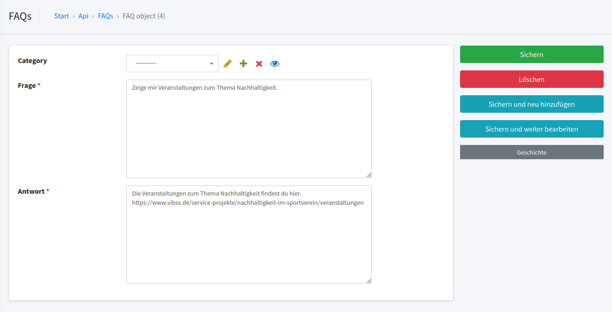

# ReStart Chatbot

## Inhaltsverzeichnis
- [1.Einführung](#1-einführung)
  - [1.1. Chatbots/LLM'S](#11-chatbotsllms)
  - [1.2. Retrieval Augmented Generation (RAG)](#12-retrieval-augmented-generation-rag)
  - [1.3. Wissensbasen (Vektordatenbanken)](#13-wissensbasen-vektordatenbanken)
  - [1.4. ReStart-Chatbot Einschränkungen](#14-restart-chatbot-einschränkungen)
- [2. Chatbot Adminbereich](#2-chatbot-adminbereich)
  - [2.1 Dashboard](#21-dashboard)
  - [2.2. Einen Chatbot einrichten](#22-einen-chatbot-einrichten)
    - [2.2.1. Generelles Hinzufügen und Löschen von Elementen](#221-generelles-hinzufügen-und-löschen-von-elementen)
    - [2.2.2. Wissensbasen hinzufügen](#222-wissensbasen-hinzufügen-)
    - [2.2.3. Quell Links](#223-quell-links)
    - [2.2.4. FAQs und FAQ Kategorien](#224-faqs-und-faq-kategorien)
    - [2.2.5. Chatbots](#225-chatbots)
      - [2.2.5.1. Chatbot Regeln](#2251-chatbot-regeln)
      - [2.2.5.2. Chatbot als Admin testen](#2252-chatbot-als-admin-testen)
  - [2.3. Benutzer](#23-benutzer)
  - [2.4. Weitere Einstellungen](#24-weitere-einstellungen)

Version 1.0.2 - 16.12.2024

Erstellt durch 

Helm & Walter IT-Solutions GbR  
Räcknitzhöhe 35a  
01217 Dresden  
info@helmundwalter.de

#
#
#
#
#
# 1. Einführung
Die folgende Dokumentation beschreibt die Funktionsweise und Einrichtung des implementierten Chatbots im Projekt 
**"ReStart Chatbot"**, welcher durch die Helm & Walter IT-Solutions GbR umgesetzt wurde.

Es wird vorerst eine kurze Erklärung zu Chatbots und der dahinterliegenden Technik (LLMs), sowie dem RAG-Prozess 
(Retrieval Augmented Generation) und Vektordatenbanken/Wissensbasen gegeben. Ein grundlegendes Verständnis dieser 
Techniken wird benötigt, um das Projekt einzurichten und sicherzustellen, dass die angestrebte Funktionsweise 
gewährleistet ist.

## 1.1. Chatbots/LLM'S
Large Language Models (LLM's) sind KI-Modelle, die auf großen Textmengen trainiert werden. Diese KI-Modelle werden von 
Firmen wie OpenAI im Internet zur Verfügung gestellt und können über Schnittstellen in eigener Software verwendet 
werden (so auch hier in diesem Chatbot). Diese Modelle haben durch die aufwendigen Trainingsmethoden bereits viele 
Funktionen wie natürliche Konversation, Kontextverständnis und ein breites "Allgemeinwissen" zu den unterschiedlichsten 
Themen. Wenn diese KI-Modelle nun für ein spezielles Thema genutzt werden sollen, z.B. die aktuellen Informationen 
eines Sportbundes mit einem Chatbot bereitzustellen, gibt es zwei Möglichkeiten: 

1. Das KI-Modell bei jeder aktuellen Änderung neu zu trainieren (sehr kosten- und ressourcenaufwendig und deshalb nicht praktikabel) oder 
2. die aktuellen Informationen in einer Vektordatenbank (Wissensbasis) zu halten und über einen Prozess in die 
Antwortgenerierung des KI-Modells mit einfließen zu lassen (Retrieval Augmented Generation (RAG)). 

## 1.2. Retrieval Augmented Generation (RAG)
Der RAG Prozess beschreibt, wie einem LLM/KI-Modell zusätzliche/aktuelle Informationen zur Verfügung gestellt 
werden, um diese in die Antwortfindung einzubeziehen. Der Prozess ist in Abbildung 1 dargestellt. 

<p align="center">
    
    <br>
    <em><i>Abbildung 1 RAG Prozess 
    (<a href="https://www.flaticon.com/free-icon/artificial-intelligence_900961?term=ai&page=1&position=5&origin=search&related_id=900961"> Quelle: AI-Icon</a> (11.12.24))</i></em>
</p>

Erklärung des RAG Prozesses:
1. Der Nutzer stellt dem Chatbot eine Frage. 
2. Diese Anfrage wird über einen Algorithmus in einen hochdimensionalen Vektor umgerechnet. Alle aktuellen Informationen
(von Websites, FAQs usw.) sind bereits als Vektoren in der Vektordatenbank/Wissensbasis abgespeichert.
3. Durch das spezielle Format dieser Vektoren können ähnlichkeitsbasierte Abfragen in diesen Wissensbasen 
durchgeführt und zurückgegeben werden.
4. Die Frage im Chatfenster und der Kontext/die aktuellen Informationen werden dem LLM gemeinsam übergeben.
5. Das LLM/KI-Modell gibt eine Antwort basierend auf den aktuellen Informationen und seines eigenen "Wissens" über 
Sprache/Formulierung usw. an den Nutzer zurück. 

Das vorliegende System ist allerdings noch deutlich komplexer, z.B. gibt es einen Zwischenschritt, in welchem die 
Nutzerfrage mithilfe des Kontextes spezifischer ausformuliert wird, um relevantere Dokumente zu finden.

## 1.3. Wissensbasen (Vektordatenbanken)
In den Wissensbasen können unterschiedliche Formen von Informationen abgespeichert werden. Ein wichtiger Ausgangspunkt 
für die Suche nach aktuellen Informationen ist die Website des Chatbotbetreibers. Diese Seite kann über einen 
rekursiven Algorithmus durchsucht werden (Crawling). Bei diesem Crawling werden Texte auf der Website, Bilder und 
PDF Dokumente heruntergeladen und als hochdimensionale Vektoren in der Wissensbasis für eine zukünftige 
Ähnlichkeitssuche abgespeichert. Also sind alle Informationen von Websites, die gecrawlt/durchsucht werden auch für 
mögliche Antworten des Chatbots verfügbar.

Angenommen, es sollen weitere Informationen (über die der Website/Websites hinaus) bereitgestellt werden, können auch 
manuell Informationen in Form von FAQs ("Frequently Asked Questions" - oft gestellte Fragen) angegeben werden. Diese 
FAQs werden ebenfalls in einer Wissensbasis abgespeichert. 

Prinzipiell können unterschiedlichen Chatbots auch unterschiedliche Wissensbasen zur Verfügung gestellt werden. 
Das heißt, nicht jeder Chatbot muss/kann das gleiche zusätzliche "Wissen" haben wie ein anderer.

## 1.4. ReStart-Chatbot Einschränkungen
Alle Chatbots, die in der Anwendung angelegt werden können, sind Richtlinien und Begrenzungen unterworfen. 
Der Chatbot hat lediglich Zugriff auf sein eigenes "Wissen" und die Informationen, die ihm in Form der Wissensbasen 
zur Verfügung gestellt werden. Er ist kein Nachforschungsassistent und kann bei Fragen, die eine komplexere Analyse 
erfordern, nur bedingt Auskunft geben. Jeder Chatbot ist so eingestellt, dass er freundlich und hilfreich antwortet.

Der Bot beantwortet alle Fragen, die mit der Wissensbasis abgedeckt sind. Er gibt keine Auskünfte, ohne dass es dafür
eine Quelle gibt. Er wird die Quelle selbst angeben, weshalb es je nach Quelle hier zu Halluzinationen (erfundene 
Antworten, die semantisch korrekt erscheinen, aber faktisch falsch sind) kommen kann.

In der Regel sollte der Bot, falls die gestellte Frage sein Wissen/das der Wissensbasis überschreitet, freundlich darauf 
verweisen, dass er diese Frage nicht beantworten kann. 

Wenn der Chatbot Unzufriedenheit feststellt oder 
die Bewertung am Ende negativ ausfällt, wird die Option angezeigt, einen Mitarbeiter zu kontaktieren. Gleiches gilt für 
den Fall, wenn keine Quelle gefunden wird. 

### Budgetverwaltung
In der ReStart-Chatbot-Anwendung wird der OpenAI-Chatbot verwendet. Um sicherzustellen, dass der Chatbot kontinuierlich 
funktioniert, muss das zugehörige OpenAI-Konto über ausreichend Budget verfügen. Wenn das Budget aufgebraucht ist, 
zeigt der Chatbot eine generische Fehlermeldung an und kann keine weiteren Anfragen beantworten, bis das Budget 
wieder aufgeladen wird. Es ist daher wichtig, das Budget regelmäßig zu überprüfen und rechtzeitig aufzustocken.

# 2. Chatbot Adminbereich
Alle Einstellungen werden über den Chatbot Adminbereich vorgenommen. Hier können die erklärten Punkte eingestellt und 
angelegt werden, welche für die angestrebte Funktionsweise mit RAG Prozess nötig sind.
Dazu zählen: 
- Anlegen von Chatbots 
- Anlegen von Wissensbasen 
- Speichern von Links zu Websites, die gecrawlt/durchsucht werden sollen
- Anlegen von FAQs und FAQ Kategorien
- Verwaltung von Nutzern 
- Datentracking 

Login-Daten für den Chatbot Adminbereich muss der Server-Administrator festlegen und übermitteln.

## 2.1 Dashboard
Die erste Seite, auf die man im Chatbot Adminbereich stößt, wenn man den zugehörigen Link öffnet 
(z.B. [https://domain/admin/](https://domain/admin/)) ist das sogenannte **"Dashboard"**, also die Home/Main Seite.

Hier ist als Erstes eine Übersicht zu den Besucherzahlen und Interaktionen von Nutzern mit dem Chatbot zu finden. 
Es wird die Anzahl der Interaktionen am jeweiligen Tag aufgezeichnet, die Dauer der Besuchszeit und auch wie oft der 
Chatbot mit Like oder Dislike bewertet wurde (Abbildung 2). 

Darunter ist ein Schnellzugriff auf die jeweiligen API 
/Crawler und Authentifizierungseinstellungen sowie die Einrichtung periodischer Aufgaben (Abbildung 3). 
Alle diese Punkte können auch links über die dunkelgraue Navigationsleiste 
erreicht werden (Abbildung 4). 

Außerdem wird eine Liste mit den letzten Aktionen am Rand eingeblendet 
(hinzugefügte Links, Chatbots usw.).

<p align="center">
    
    <br>
    <em><i>Abbildung 2 Dashboard Interaktionstracking</i></em>
</p>
<p align="center">
    
    <br>
    <em><i>Abbildung 3 Dashboard Settings</i></em>
</p>
<p align="center">
    
    <br>
    <em><i>Abbildung 4 Dashboard Settings Navigationsleiste</i></em>
</p>

## 2.2. Einen Chatbot einrichten
Im Folgenden wird der Ablauf beschrieben, um alle nötigen/möglichen Elemente für die Benutzung eines Chatbots End-to-End 
einzurichten. Die einzelnen Schritte können teilweise auch unabhängig voneinander durchgeführt werden, jedoch wird die 
beschriebene Reihenfolge empfohlen.

### 2.2.1. Generelles Hinzufügen und Löschen von Elementen
Um die Einrichtung vorzunehmen, müssen verschiedene Elemente erzeugt/hinzugefügt werden, damit der RAG Prozess und 
somit der Chatbot funktioniert. Das Hinzufügen funktioniert immer gleich (egal, ob Chatbot, Wissensbasis, FAQ, ...) 
auf der jeweiligen Seite findet sich in der rechten oberen Ecke immer ein grüner Button mit einem mit 
**"*+ ...hinzufügen*"**, wie auch in Abbildung 5 dargestellt.  
<p align="center">
    
    <br>
    <em><i>Abbildung 5 Hinzufügen von Elementen</i></em>
</p>

Wenn zukünftig also davon gesprochen wird, Elemente hinzuzufügen, ist immer dieser Button gemeint.

Wenn der Button **"Hinzufügen"** gedrückt wurde, erscheint der jeweilige Bereich zum Hinzufügen des Elements und rechts 
daneben eine Auswahl an Buttons (siehe Abbildung 6). 

Wenn in diesem Bereich alles ausgefüllt und korrekt angegeben ist, 
kann entweder auf **"Speichern"** gedrückt werden, um das Element zu speichern und in der Liste anzuzeigen, oder auf 
**"Speichern und neu hinzufügen"** (damit wird das Element gespeichert und direkt das Fenster zum Hinzufügen eines 
neuen geöffnet). 
**"Speichern und weiter bearbeiten"** analog, nur dass das aktuelle Element weiter bearbeitet werden kann.

Wenn ein Element gespeichert wurde und man es erneut in der Liste von Elementen auswählt, ändert sich die Buttonanzeige 
wie in Abbildung 7 dargestellt. Hier kann nun das gespeicherte Element auch wieder gelöscht werden (**"Löschen""**) oder die 
**"Geschichte"** angezeigt werden (wann wurde das Element von welchem Nutzer erzeugt).

<table style="width: 80%; margin: 0 auto; border-collapse: collapse;">
  <tr style="border: none;">
    <td style="border: none; width: 50%"></td>
    <td style="border: none; width: 50%"></td>
  </tr>
  <tr style="border: none;">
    <td style="border: none; text-align: center;"><i>Abbildung 6 neues Element speichern</i></td>
    <td style="border: none; text-align: center;"><i>Abbildung 7 Buttons nach Speichern</i></td>
  </tr>
</table>

### 2.2.2. Wissensbasen hinzufügen 
Das Herzstück des RAG Prozesses ist die Wissensdatenbank/Wissensbasis. Dort werden die aktuellen Informationen aus 
FAQs und Crawlings gespeichert. Deshalb ist es sinnvoll, als ersten Schritt im Reiter **"Wissensbasen"** eine Wissensbasis 
hinzuzufügen. 

Beim Hinzufügen muss lediglich ein aussagekräftiger **"Name"** angegeben werden und optional eine **"Beschreibung"**. 
Prinzipiell ist es ratsam für einen einzigen Chatbot auch nur eine Wissensbasis anzulegen, die sowohl Crawlings als auch 
FAQs beinhaltet. Es ist möglich auch mehrere Wissensbasen für Testzwecke eines oder auch mehrerer Chatbots anzulegen, 
jedoch können viele verschiedene Wissensbasen für einen Chatbot langfristig auch zu einem performance Problem führen. 

Wurde eine Wissensbasis hinzugefügt und gespeichert, findet sie sich in der Liste aller Wissensbasen wieder.
Hier ist auch die automatisch vergebene **"ID"** zu sehen und ein Counter (**"Points Count"**), welcher Aufschluss darüber gibt, 
wie viele Datenpunkte in der Wissensbasis verfügbar sind (eine FAQ wäre z.B. ein Datenpunkt).

### 2.2.3. Quell Links
Eine große Menge an aktuellen Informationen wird, wie bereits erwähnt, von den angegebenen Websites automatisch 
gesucht/gecrawlt und in die Wissensbasis eingetragen. 

Es sollten unter dem Reiter **"Quell Links"** ein oder mehrere Crawl-Links hinzugefügt werden.
Hier muss bei **"Website-URL"** die Adresse der zu durchsuchenden Website angegeben werden z.B.:
[https://www.vibss.de/](https://www.vibss.de/). 

Außerdem muss eine **"Wissensbasis"** ausgewählt werden, in der die gecrawlten 
Inhalte abgespeichert werden. 

Das Häkchen **"Tiefensuche"** gibt an, ob auch Links, die auf der angegebenen Website verlinkt sind, gecrawlt werden sollen. 
Dabei folgt der Algorithmus nur Links der gleichen Domain. Subdomains oder externen Links folgt der Crawler **nicht**. 

Die Einstellung **"Inhaltsauswahl"** und **"Ausgeschlossene Selektoren"** 
ermöglicht es über CSS selektoren z.B. #main nur bestimmte Bereiche einer Website zu crawlen oder auch auszuschließen. 
Diese Punkte sind besonders wichtig und sollten von jemandem mit Webentwicklungserfahrung eingetragen werden. Es sollte
darauf geachtet werden, dass keine irrelevanten Informationen wie Navigationsleisten, "Text vorlesen" - Funktionen usw.
in die Datenbank eingetragen werden. 
Es können hier auch mehrere Selektoren übergeben werden (kommagetrennt). 

Die Eingabe **"Nach X Tagen löschen"** gibt den zeitlichen Spielraum an, wann Informationen, die seit diesem Zeitpunkt 
nicht mehr auf der Website gefunden werden, aus der Wissensbasis gelöscht werden. Die Angabe erfolgt hier deshalb, um 
bei einem möglichen Ausfall der Seite nicht die komplette Wissensbasis zu verlieren. Alle Informationen, die allerdings
im Zeitraum von X Tagen nicht mehr auf der Website zu finden sind, werden aus der Wissensbasis gelöscht. 

Die Angabe **"Crawling Intervall"** gibt an, alle wie viel Tage dieser Link/diese Website gecrawlt 
wird. Selteneres Crawling kann hier Ressourcen sparen, führt aber auch zu weniger aktuellen Informationen. Wenn sich die 
Informationen auf der Seite nicht oft ändern, kann ein höheres Crawlingintervall Kosten sparen. 

Die restlichen Angaben sind Informationen, wann dieser Link das letzte Mal gecrawlt wurde, wie viele Elemente dabei 
verarbeitet wurden und wann dieser Link erzeugt/hinzugefügt wurde. 

Das Crawling kann nach Abspeichern des Crawl Links 
über den Button **"Start Crawl"** gestartet werden. Dieser Prozess kann einige Zeit in Anspruch nehmen. Wurde der Button 
betätigt, fängt der Crawler im Hintergrund an, alle Informationen von der angegebenen Website und evtl. weiteren 
Verlinkungen auf der Website zu downloaden und in der Wissensbasis zu speichern.

Der Prozess kann dann ebenfalls durch den Button: **"Stop Crawl"** wieder gestoppt werden. Alle Informationen, die zu diesem
Zeitpunkt in der Wissensbasis gespeichert wurden, verbleiben allerdings dort. 

### 2.2.4. FAQs und FAQ Kategorien
Hier kann der Betreiber des Chatbots Informationen 
speichern zu Fragen, die oft an den Chatbot gestellt werden könnten. FAQs können und 
sollten besonders auch für spezielle Fragen genutzt werden, bei denen der Bot sonst Probleme haben könnte zu antworten 
(spezielle Ansprechpartner usw.) oder komplexe Fragestellungen, welche eine gründlichere Recherche oder Spezialwissen 
erfordern. 

Das Hinzufügen von FAQs funktioniert über die Zuweisung an FAQ Kategorien. Das Hinzufügen einer Kategorie funktioniert 
über den Reiter **"FAQ-Kategorien"**. Dort muss lediglich ein Name und die Wissensbasis angegeben werden, in der alle FAQs 
die zu dieser Kategorie zugeordnet und gespeichert werden. 
Nachdem eine FAQ Kategorie erzeugt/hinzugefügt wurde, kann
die Wissensbasis dieser Kategorie nicht mehr geändert werden. Alle FAQ Kategorien sollten auch die gleiche Wissensbasis
verwenden, es sei denn es wurden z.B. verschiedene Chatbot Versionen zum Testen erstellt.

Die Erzeugung von FAQs erfolgt analog (Reiter **"FAQs"** im Dashboard). Hier 
muss eine der erzeugten **"FAQ Kategorien"** ausgewählt werden. Danach muss jeweils die 
**"Frage"** und auch die bevorzugte **"Antwort"** auf diese Frage eingegeben werden 
(siehe Abbildung 8).

Es ist durch diese Aufteilung (FAQs und FAQ-Kategorien) möglich, im Anschluss nach verschiedenen Kategorien zu suchen 
und auch gesammelt mehrere FAQs zu anderen Kategorien zuzuweisen und damit auch anderen Wissensbasen.

<table style="width: 90%; margin: 0 auto; border-collapse: collapse;">
  <tr style="border: none;">
    <td style="border: none; width: 50%"></td>
  </tr>
  <tr style="border: none;">
    <td style="border: none; text-align: center;"><i>Abbildung 8 Erzeugen von FAQs</i></td>
  </tr>
</table>

### 2.2.5. Chatbots
Nachdem alle relevanten Informationen mittels Crawling und FAQs in der/den Wissensbasis/basen gespeichert sind, muss unter 
dem Reiter **"Chatbots"** ein Chatbot hinzugefügt werden (auch hier ist es möglich, mehrere Chatbots zu erzeugen). 

Hier muss eine **"Header Überschrift"** (die Überschrift im Chat) und der **"Chatbot Name"** angegeben werden 
(kann analog zur Überschrift sein, z. B. ReStart-Chatbot). 

In der Auswahl darunter sollte mindestens eine der 
**"Wissensbasen"** ausgewählt und dem Chatbot zugewiesen werden (hier sind wie gesagt auch mehrere Wissensbasen möglich). 
Auf der ersten Seite können dem Chatbot außerdem einige Regeln übergeben werden. Siehe dazu die Beispiele in Kapitel: 
[2.2.5.1. Chatbot-Regeln](#2251-chatbot-regeln).

Anschließend sollte in der oberen Menü-Reiter-Auswahl (siehe Abbildung 9) das **"Erscheinungsbild"** mit Farben und Logos angepasst werden. 
Die **"Primäre Farbe"** stellt die Hintergrundfarbe der geschriebenen Textnachrichten sowie das generelle "Farbbild" 
(Hintergründe usw.) ein, die **"Textfarbe"** die Farbe des Textes in der Chatnachricht. 
Es sollte hier auf einen möglichst hohen Kontrast zwischen diesen Farben geachtet werden, 
z. B. Dunkelblau als Primärfarbe und Weiß als Textfarbe.

Im nächsten Reiter (**"Kontaktdaten"**) müssen Kontaktinformationen mit **"Name"** und **"E-Mail-Adresse"** angegeben werden. 

Um den Chatbot auf Ihrer Seite einbinden zu können, muss der HTML-Code für den jeweiligen Chatbot kopiert und auf 
Ihrer Seite eingefügt werden. Siehe dazu den generierten Code (wie auch in Abbildung 10) unter dem Reiter 
**"Integration"**. Beachten Sie, dass nur diejenige Website auf den Chatbot zugreifen kann, welche zuvor während der
Installation der Software hinterlegt wurde.

Im Reiter **"Übersetzungen"** müssen folgende Punkte in jeder Sprache hinzugefügt werden: 
- **"Willkommenstitel"**
- **"Willkommenstext"**
- **"Weiterer Willkommenstext"**
- **"Erste Nachricht"**

Alle Felder sollten, im HTML Format angegeben werden. In der beiliegenden Datei 
"prompts_und_beispiele.md" sind auch hier funktionierende Beispiele aus dem Projekt ReStart-Chatbot im Abschnitt
"2 Übersetzungen" zu finden.
#### Leere Felder automatisch übersetzen
Wenn beispielsweise im Menüpunkt **"Übersetzung - Deutsch"** alle Angaben getroffen wurden (Willkommenstitel, 
Willkommenstext usw.), kann rechts in der Auswahl der Buttons der Button **"Leere Felder automatisch übersetzen"** gedrückt 
werden. Dieser Prozess kann einige Sekunden/Minuten dauern, jedoch werden hier alle Texte automatisch in die übrigen 
Sprachen übersetzt (Übersetzung Englisch, Türkisch usw.). 

Wenn die automatische Übersetzung erfolgreich abgeschlossen 
ist, erscheint über der Navigationsleiste ein blaues (i) Info-Feld mit der Meldung, dass alle Übersetzungen automatisch
durchgeführt wurden und nun abgeschlossen sind. 

Es sollte daran gedacht werden, die Ergebnisse nach automatischer 
Übersetzung zu speichern **("Speichern"**-Button).

<table style="width: 90%; margin: 0 auto; border-collapse: collapse;">
  <tr style="border: none;">
    <td style="border: none; width: 50%"></td>
  </tr>
  <tr style="border: none;">
    <td style="border: none; text-align: center;"><i>Abbildung 9 Chatbots hinzufügen und über Menü-Reiter-Auswahl konfigurieren</i></td>
  </tr>
  <tr style="border: none;">
    <td style="border: none; width: 50%"></td>
  </tr>
  <tr style="border: none;">
    <td style="border: none; text-align: center;"><i>Abbildung 10 Integration des Chatbots auf Ihrer Seite</i></td>
  </tr>
</table>

#### 2.2.5.1. Chatbot Regeln
Dem Chatbot können auf der vordersten Seite einige Regeln übergeben werden. Die Regeln sind optional, können jedoch die 
Antwortqualität deutlich verbessern, indem sie dem Bot sagen, was seine Aufgabe ist. 

Zusätzlich kann ihm gesagt werden, 
wie er sich verhalten soll. Allerdings gibt es keine Garantie, dass der Bot den Anweisungen folgt, insbesondere, 
wenn diese sehr komplex sind. Eine große Menge an Anweisungen kann den Chatbot hier von seiner Hauptaufgabe, dem Extrahieren
und korrekten Wiedergeben von Informationen, ablenken.

Es ist zu beachten, dass jedes Wort in diesen Anweisungen die API-Kosten pro Anfrage erhöht. Anweisungen sollten deshalb 
so kompakt und eindeutig wie möglich formuliert werden. Pro Anfrage ist der Unterschied gering, bei 10.000 Anfragen 
pro Monat kann sich ein einzelner Satz schon in ein paar Euro an Kosten niederschlagen. Es ist allerdings auch zu 
erwarten, dass die Kosten in wenigen Jahren nur noch einen Bruchteil betragen und neuere KI-Modelle auch komplexeren 
Anweisungen folgen können. Auch kleine Änderungen können einen großen Einfluss auf die Antwortqualität haben, sodass 
diese gründlich getestet werden sollten (z. B. mit einem Test-Chatbot). 

Sofern ein Support-Vertrag besteht, kann der Dienstleister automatisierte Tests auf Basis von hunderten Antworten 
durchführen und die Änderung in der Antwortqualität somit bestimmen.

Im Folgenden werden die Anweisungen/Prompts (wie bereits erwähnt unter dem Reiter **"Grundlegende Informationen"** einzutragen) 
erklärt und auch einige Beispiele gegeben. 
Die tatsächlichen Prompt-Beispiele sind in der mitgelieferten Markdowndatei ("prompts_und_beispiele.md") 
im Abschnitt "1 Chatbot Regeln" aufgelistet.

##### Zusätzliche Eingaben für den Hauptprompt: 
Hierbei handelt es sich um den Teil des Systems, welcher die Finale Antwort mit Quellen formuliert. 

Das zugehörige Beispiel ist in der beiliegenden Markdown Datei unter dem Punkt "Zusätzliche Eingaben für den 
Hauptprompt" zu finden. 

Zusätzliche Erklärung: Der Abschnitt, welcher durch
```prompt
 ... 
```
eingegrenzt wird, markiert hier einen Textblock, der nur für die deutsche Sprache eingesetzt wird. Gleiches ist auch für
andere Sprachen möglich ('en' für Englisch usw.).

##### Zusätzliche Eingaben für Antworten ohne Quellen:
Hier handelt es sich um den Abschnitt, der für Antworten ohne Quellen verantwortlich ist. Es sollte an dieser Stelle 
vermieden werden anzuweisen, dass er hilfreich sein soll, da er sonst doch ohne Quellen Antworten geben könnte, 
anstatt nur Smalltalk zu führen.

Das zugehörige Beispiel ist in der beiliegenden Markdown Datei unter dem Punkt "Zusätzliche Eingaben für Antworten 
ohne Quellen" zu finden. 

##### Zusätzliche Eingaben für den Abfrageoptimierer: 
Der Abfrageoptimierer bekommt die Frage des Nutzers und die bisherige Konversation und formuliert daraus eine 
detailliertere Frage. Hier kann man den Kontext, in welchem die Fragen gestellt werden, beschreiben, um bessere 
Ergebnisse zu bekommen. Wenn z. B. ein Nutzer sehr allgemein fragt: "Was macht ein Verein?", könnte der Optimierer 
mit einem Hinweis, dass es um die Website eines Landessportbundes geht, die Frage zu "Was macht ein Sportverein?" 
konkretisieren.

Auch hier ist weniger oft mehr, zu viele Informationen könnten auch zu überspezifischen Anfragen führen, die dann 
schlechtere Ergebnisse liefern.

Das zugehörige Beispiel ist in der beiliegenden Markdown Datei unter dem Punkt "Zusätzliche Eingaben für den 
Abfrageoptimierer" zu finden.

##### Zusätzliche Eingaben für verwandte Fragen: 
Die verwandten Fragen werden extra ermittelt, und man kann hier Regeln dazu angeben. Insbesondere wenn man feststellt, 
dass unpassende Fragen kommen, kann man damit gegensteuern.

Das zugehörige Beispiel ist in der beiliegenden Markdown Datei unter dem Punkt "Zusätzliche Eingaben für verwandte 
Fragen" zu finden.

#### 2.2.5.2. Chatbot als Admin testen
Auf der Startseite des Reiters **"Chatbots"** befindet sich in der Liste aller Chatbots die Demo des Chatbots zum Testen
(siehe dazu Abbildung 11). Hier kann der Chatbot als Chatfenster oder auch im Fullscreen Modus getestet werden. 
<p align="center">
    
    <br>
    <em><i>Abbildung 11 Chatbot als Admin testen</i></em>
</p>

## 2.3. Benutzer
Um neben dem ersten Admin-User auch andere Benutzer mit Adminrechten für den Chatbot-Adminbereich erzeugen zu können, 
muss unter dem Reiter **"Benutzer"** ein neuer User hinzugefügt werden. Wichtig ist hier der Nutzername und die Vergabe 
eines sicheren Passworts. Ansonsten ist das Speichern/Hinzufügen und Löschen analog zu allen anderen Elementen.

Nach dem Speichern können zu jedem Nutzer noch **"Persönliche Informationen"**, **"Berechtigungen"** und andere **"Wichtige 
Daten"** (letzte Anmeldung bzw. Mitglied seit) angezeigt und angepasst werden.

Beim Anlegen eines weiteren Admin Nutzers, ist es wichtig, dass unter dem Reiter **"Berechtigungen"** das Häkchen mit
**"Administratorstatus"** ausgewählt ist (siehe Abbildung 12).

<p align="center">
    
    <br>
    <em><i>Abbildung 12 neuen Admin User hinzufügen</i></em>
</p>

## 2.4. Weitere Einstellungen
Alle weiteren Einstellungen wie Gruppen oder periodische Aufgaben sind für die Anwendung und Einrichtung im Rahmen
des Projekts **"ReStart Chatbot"** nicht relevant. 

